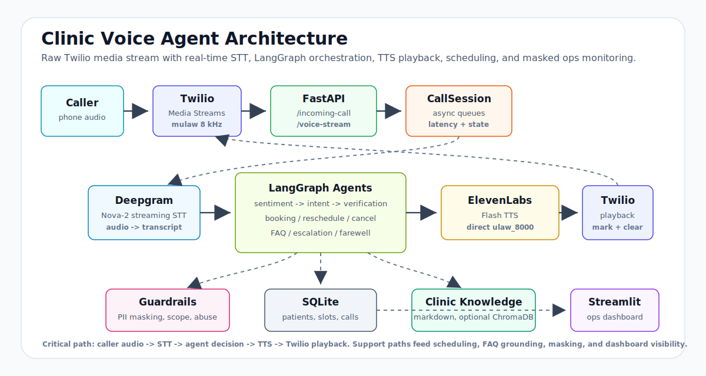

# Clinic Voice Agent

Clinic Voice Agent is a demo-ready healthcare voice assistant for phone-based appointment workflows. A caller can speak naturally to book, reschedule, or cancel an appointment, ask common clinic questions, or get escalated to the front desk. The system runs on a raw Twilio media pipeline rather than a hosted voice-agent platform, so the repo shows the full real-time STT, agent-routing, TTS, and dashboard path end to end.

The current project state is portfolio-ready: the five live scenarios have been validated, dashboard masking has been reviewed, and the automated suite is green at `128 passed, 2 warnings`.

## What It Does

- Answers real phone calls through Twilio Media Streams.
- Streams caller audio to Deepgram Nova-2 for low-latency transcription.
- Routes each turn through a LangGraph multi-agent workflow.
- Uses Groq LLaMA 3.3 70B for intent classification, verification extraction, and FAQ answers.
- Books, reschedules, and cancels appointments against a SQLite clinic database.
- Streams ElevenLabs Flash speech back to Twilio as direct `ulaw_8000` audio.
- Displays masked call transcripts, outcomes, latency, sentiment, and escalation summaries in Streamlit.

## Why This Is Technically Interesting

This project deliberately avoids hosted voice-agent platforms like Vapi or LiveKit Agents. Instead, it implements the real-time media path directly: Twilio WebSocket events, mulaw audio frames, Deepgram streaming STT, LangGraph turn orchestration, ElevenLabs streaming TTS, and Twilio playback.

That makes the repo more than a prompt wrapper. It includes the systems work that production voice agents depend on:

- Real-time audio handling with Twilio Media Streams and direct `ulaw_8000` TTS output.
- Async WebSocket orchestration with separate queues for inbound audio, finalized transcripts, agent turns, and outbound speech.
- Barge-in using audio-level VAD plus Twilio `mark` and `clear` events to stop buffered playback.
- Stateful multi-agent routing with verification gates, appointment workflow memory, and same-call reschedule/cancel targeting.
- SQLite slot locking with a 60-second timeout so concurrent callers cannot double-book the same appointment.
- PII masking across logs, stored transcripts, summaries, dashboard views, and optional escalation notifications.

The goal was to show the full voice-agent stack: telephony, streaming audio, agent state, safety, scheduling reliability, and live operator visibility.

## Real-Time Architecture



Core turn loop: `Caller -> Twilio Media Stream -> FastAPI WebSocket -> Deepgram STT -> LangGraph agents -> ElevenLabs ulaw TTS -> Twilio playback`.

Supporting paths:

- SQLite stores patients, slots, appointments, locks, call history, and dashboard metrics.
- Markdown clinic knowledge grounds FAQ answers by default; ChromaDB retrieval is optional.
- Guardrails mask PII, detect abuse/scope issues, and support safe escalation.
- Streamlit reads masked call history for live operational visibility.

## Agent Workflow

Every finalized caller utterance enters the graph at `sentiment`, then moves to `intent`.

Appointment workflows pass through `verification` before any scheduling action. Booking and reschedule share the same slot-filling machinery: doctor, date, time, reason, and confirmation. FAQ and escalation skip verification so the caller can get clinic information or a front-desk handoff without friction.

Key live-demo behaviors:

- Booking accepts inline date/time requests such as "tomorrow at 9 AM" when the requested time is in the offered slots.
- Reschedule and cancel target the latest appointment created during the current call before falling back to the earliest upcoming database appointment.
- Cancellation is confirm-before-cancel. The agent identifies the appointment and waits for an affirmative response before making the destructive change.
- Farewell handling keeps "no, that's all" from being misclassified as a new workflow.

## Tech Stack

| Layer | Technology |
| --- | --- |
| Telephony | Twilio Media Streams, mulaw 8 kHz |
| Server | FastAPI, uvicorn, asyncio WebSocket handling |
| Speech to text | Deepgram Nova-2 streaming STT |
| Agent graph | LangGraph `StateGraph` |
| LLM | Groq `llama-3.3-70b-versatile` |
| Text to speech | ElevenLabs Flash `eleven_flash_v2_5`, direct `ulaw_8000` output |
| Scheduling store | SQLite `clinic.db` |
| FAQ knowledge | Markdown files in `rag/clinic_knowledge`; optional ChromaDB at `rag/chroma_db` |
| Dashboard | Streamlit and pandas |
| Tests | pytest with external API calls mocked |

## Data Stores

- `clinic.db` stores doctors, patients, slots, appointments, and call history.
- `rag/clinic_knowledge/` stores the source markdown for clinic hours, insurance, services, parking, and visit prep.
- `rag/chroma_db/` is optional persisted ChromaDB state for vector retrieval.

Agents use the `db/` module for database access. They do not query SQLite directly.

## Safety And Reliability

- PII masking covers phone numbers, DOB contexts, emails, and verified patient names in logs, dashboard transcripts, and summaries.
- Appointment dates remain visible in masked logs so the dashboard stays useful without exposing DOBs.
- Abuse and frustration guardrails route callers to escalation when needed.
- Scope detection gives bounded responses for out-of-scope requests and lets later in-scope turns recover.
- Slot locking uses optimistic SQLite updates with a 60-second lock timeout to prevent double-booking.
- Unconfirmed locked slots are released on call cleanup.
- Barge-in uses a lightweight mulaw RMS VAD instead of raw media packets.
- Twilio `mark` events track outbound playback, and `clear` flushes buffered TTS when caller speech interrupts.

## Setup

### 1. Create the environment

```bash
python -m venv .venv
source .venv/bin/activate
pip install -r requirements.txt
```

Python 3.11+ is recommended.

### 2. Configure `.env`

```bash
cp .env.example .env
```

Fill in local credentials for:

- `GROQ_API_KEY`
- `DEEPGRAM_API_KEY`
- `ELEVENLABS_API_KEY`
- `ELEVENLABS_VOICE_ID`
- `TWILIO_ACCOUNT_SID`
- `TWILIO_AUTH_TOKEN`
- `TWILIO_PHONE_NUMBER`
- `PUBLIC_HOST`

Optional settings:

- `FAQ_RETRIEVAL_MODE=markdown` for stable demo FAQ answers from local markdown.
- `FAQ_RETRIEVAL_MODE=chroma` to use the ChromaDB vector store.
- `BARGE_IN=1` to enable interruption handling.
- `SLACK_WEBHOOK_URL` for masked escalation notifications.

Do not commit `.env`, API keys, ngrok hostnames, or real patient data.

### 3. Seed the database

```bash
python seed_database.py
```

This creates or refreshes `clinic.db` with demo doctors, seeded demo patients, and appointment slots.

### 4. Ingest optional RAG data

```bash
python -m rag.ingestion
```

This populates `rag/chroma_db`. The default FAQ path uses markdown directly, so ingestion is only required when testing ChromaDB retrieval.

### 5. Run the voice server

```bash
uvicorn voice.server:app --host 0.0.0.0 --port 8000 --reload
```

### 6. Expose the server to Twilio

```bash
ngrok http 8000
```

Set `PUBLIC_HOST` in `.env` to the ngrok hostname only, without protocol or trailing slash. Restart uvicorn after changing `.env`.

### 7. Configure Twilio

Set the Twilio phone number voice webhook for incoming calls to:

```text
https://<PUBLIC_HOST>/incoming-call
```

The FastAPI route returns TwiML that connects Twilio to:

```text
wss://<PUBLIC_HOST>/voice-stream
```

### 8. Run the dashboard

```bash
streamlit run dashboard/app.py
```

The dashboard reads from `clinic.db` and refreshes every two seconds.

## Demo Scenarios

Use seeded demo patient records from the local database. Avoid real patient information in demos, logs, screenshots, and recordings.

### Booking

```text
Caller: I want to book an appointment.
Agent: asks for verification, doctor, date/time, and visit reason.
Caller: gives a seeded demo name and DOB.
Caller: says the doctor and time, for example "Dr. Chen tomorrow at 9 AM".
Agent: locks the offered slot and confirms after collecting the reason.
```

### Reschedule

```text
Caller: I need to reschedule my appointment.
Agent: verifies identity and finds the latest in-call appointment when available.
Caller: gives the new date and time.
Agent: books the replacement first, then cancels the old appointment.
```

### Cancellation

```text
Caller: I need to cancel my appointment.
Agent: verifies identity and identifies the target appointment.
Agent: asks for confirmation.
Caller: Yes, cancel it.
Agent: cancels exactly that appointment.
```

### FAQ

```text
Caller: What insurance do you accept?
Caller: What are your hours?
Caller: Where are you located?
```

FAQ answers are intentionally short: one or two phone-friendly sentences.

### Escalation

```text
Caller: I need to speak with the front desk.
```

Escalation stores a masked call summary and can optionally notify Slack when configured.

## Final Validation

Automated tests:

```bash
pytest tests/ -v
```

Current status: `128 passed, 2 warnings`.

Live validation completed:

- Booking
- Reschedule
- Cancellation with confirmation
- FAQ
- Escalation
- Streamlit transcript and summary masking
- Dashboard FAQ outcome display
- Barge-in behavior

No additional live Twilio validation is required for this cleanup pass.

## Project Structure

```text
voice/
  server.py          FastAPI /incoming-call and /voice-stream routes
  twilio_handler.py  Twilio WebSocket loop, call history, latency logging
  deepgram_stt.py    Deepgram Nova-2 streaming transcription
  elevenlabs_tts.py  ElevenLabs Flash ulaw frame generator
  audio_utils.py     Twilio media, mark, and clear helpers
  barge_in.py        mulaw RMS speech detector
  session.py         CallSession state, LangGraph invocation, TTS playback

agents/
  intent_agent.py        intent routing and active workflow preservation
  sentiment_agent.py     frustration and abuse guardrails
  verification_agent.py  name and DOB extraction, patient lookup
  booking_agent.py       appointment slot filling and booking confirmation
  reschedule_agent.py    replacement booking and old appointment cancellation
  cancellation_agent.py  confirm-before-cancel workflow
  faq_agent.py           markdown or Chroma grounded answers
  escalation_agent.py    handoff response and masked summary
  farewell_agent.py      call completion response
  appointment_workflow.py shared appointment workflow state helpers

graph/
  state.py     CallState and CallIntent
  workflow.py  LangGraph construction and lazy compile
  router.py    conditional routing
  llm.py       ChatGroq singleton

db/
  models.py        SQLite schema
  patients.py      patient lookup helpers
  doctors.py       doctor lookup helpers
  scheduling.py    slot locking, booking, release, cancellation
  appointments.py  upcoming appointment lookup
  call_history.py  dashboard call records and stats

rag/
  clinic_knowledge/ markdown source knowledge
  ingestion.py       ChromaDB ingestion
  vectorstore.py     ChromaDB query and context formatting

dashboard/
  app.py     Streamlit operations dashboard
  status.py  outcome labels and status formatting

tests/
  test_agents.py
  test_rag.py
  test_voice_pipeline.py
```

## Notes For Reviewers

- This repo intentionally uses a raw Twilio, Deepgram, and ElevenLabs pipeline to show the mechanics of real-time voice AI.
- Agent responses are constrained for phone delivery; long text-style answers are avoided.
- ChromaDB is kept as an optional retrieval mode, while markdown FAQ retrieval is the default for stable demos.
- The legacy Day 4 prototype scripts are archived under `dev/archive/legacy-day4-pipeline/` for reference. The maintained runtime is the modular `voice/` server.
